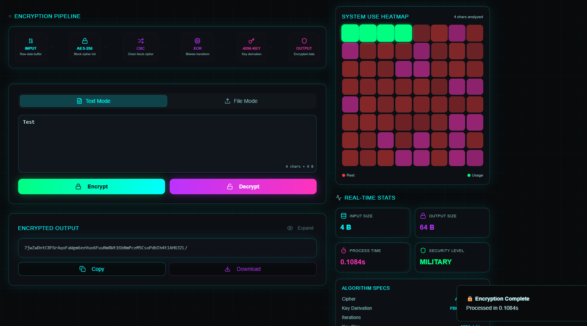
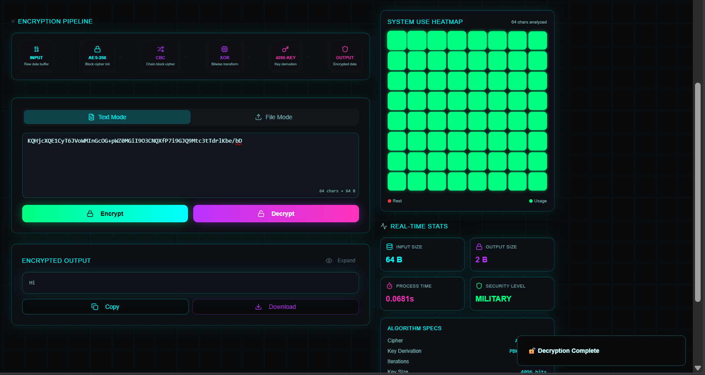
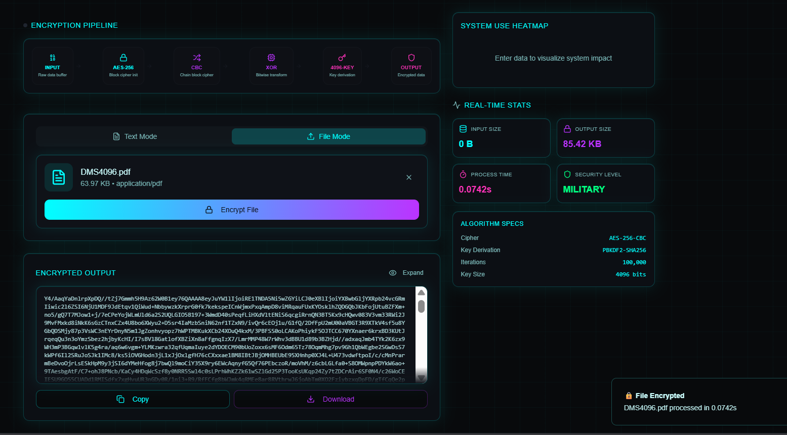
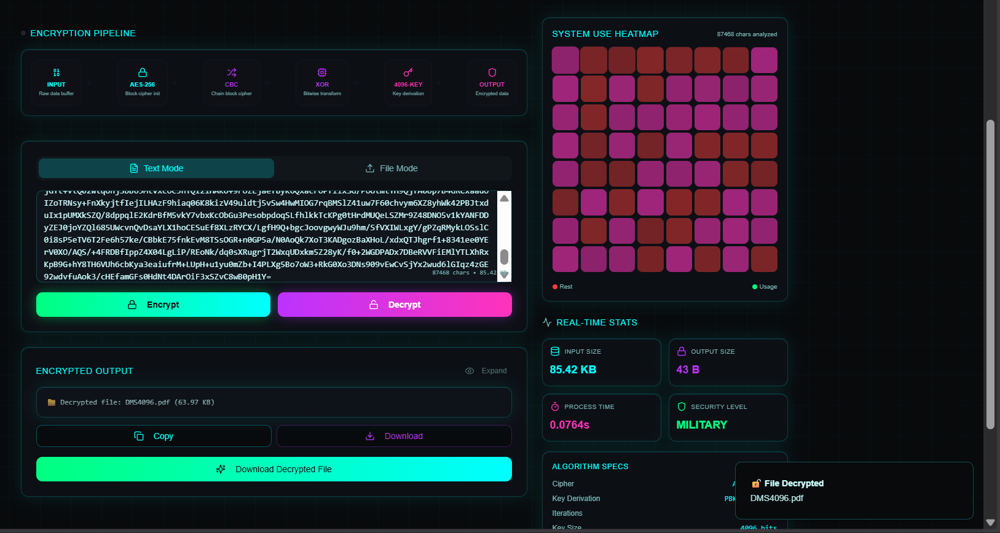
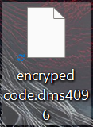

<p align="center">
  
</p>

<h1 align="center">DMS4096's - Visual Cryptographic Platform</h1>

<p align="center">
  <b>See Encryption. Understand Security. Learn by Observation.</b><br/>
  <i>A high-fidelity visualization system for modern cryptographic workflows</i>
</p>

<p align="center">
  <a href="https://www.computer.org/csdl/proceedings-article/ic3/2025/11290566/2cTzm1MBeW4">
    
  </a>
  <a href="https://rjpn.org/ijcspub/papers/IJCSP25B1020.pdf">
    
  </a>
  <a href="https://www.ijircce.com/admin/main/storage/app/pdf/BMvfeXwpVZCGY4lr63MAQjJbMW3u8CapS877V2bV.pdf">
    
  </a>
  
  
</p>

---

## 🌐 Platform Overview

**DMS4096 Visual Cryptographic Education Tool** is a specialized learning platform designed to make **complex encryption systems observable, traceable, and understandable**.

Instead of treating cryptography as a black box, this tool exposes the **internal flow of encryption and decryption** through real-time visual pipelines, system heatmaps, and deterministic stage transitions.

It is built for:
- Students and researchers
- Cybersecurity educators
- Cryptography enthusiasts
- Institutions teaching secure system design

This platform complements the **DMS4096 cryptographic architecture** by transforming it into an **interactive learning experience**.

---

## 🖥️ Complete Interface Walkthrough

### 1️⃣ Full System Interface

<p align="center">
  
</p>

<p align="center">
  <i>Unified interface showing encryption pipeline, system metrics, and live cryptographic state</i>
</p>

---

### 2️⃣ Text Encryption — Step by Step

<p align="center">
  
</p>

<p align="center">
  <i>Plaintext input → staged transformation → encrypted output with visual confirmation</i>
</p>

---

### 3️⃣ File Encryption Mode

<p align="center">
  
</p>

<p align="center">
  <i>Encrypt any file type (documents, images, videos) using the same cryptographic pipeline</i>
</p>

---

### 4️⃣ File Decryption Workflow

<p align="center">
  
</p>

<p align="center">
  <i>Controlled decryption with reverse-pipeline visualization</i>
</p>

---

### 5️⃣ Proprietary `.dms4096` File Format

<p align="center">
  
</p>

<p align="center">
  <i>Encrypted artifacts packaged in a portable, shareable `.dms4096` container</i>
</p>

---

## 🧠 Educational Capabilities

### 🔬 Real-Time Cryptographic Visualization

- Multi-stage encryption pipeline with deterministic flow
- Visual representation of diffusion and transformation stages
- System heatmap reflecting computational impact
- Clear separation between plaintext, intermediate states, and ciphertext

### 📂 Dual Interaction Modes

| Text Mode | File Mode |
|---------|----------|
| Direct plaintext input | Upload any file type |
| Instant encryption feedback | Progress-based visualization |
| Download `.dms4096` output | Full file integrity |
| Ideal for concept learning | Ideal for applied understanding |

---

## 🧩 Conceptual Workflow

1. User inputs plaintext or selects a file
2. Encryption begins locally
3. Each cryptographic stage is visualized sequentially
4. Output is packaged as `.dms4096`
5. Decryption reverses the pipeline with full visibility

This approach enables **true comprehension of cryptographic behavior**, not just usage.

---

## ⚙️ Performance Characteristics (Educational Context)

| Operation | Typical Time | Visualization |
|--------|--------------|---------------|
| Text Encryption | < 50 ms | Full pipeline |
| File Encryption (10 MB) | ~1–1.5 s | Live heatmap |
| Decryption | < 40 ms | Reverse stages |
| Key Derivation | ~8 ms | Entropy visualization |

> Performance values prioritize **clarity and observability**, not raw throughput.

---

## 🚀 Getting Started

### Prerequisites

```bash
node -v   # v18+
npm -v    # v9+

```

---

## Installation
```bash
git clone https://github.com/Devansh-567/DMS.git
cd DMS
npm install
npm start
```
